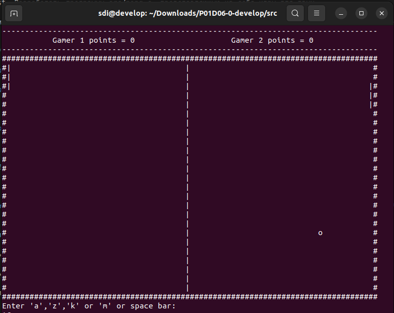

# The Game of Pong

***Разработать программу src/pong.c, представляющую из себя игру для двух 
игроков, схожую с игрой "Pong". Для отображения графики использовать только символьную (ASCII) 
графику (с выводом в терминал). Вам необходимо реализовать пошаговый вариант в рамках стандартной библиотеки.*** 

* ***Управление:***
  
***A/Z и K/M для перемещения ракеток.***

***Space Bar для пропуска действия на очередном шаге игры в пошаговом режиме.***

* ***Графика***

***Поле — прямоугольник 80 на 25 символов.***

***Размер ракетки — 3 символа.***

***размер мяча — 1 символ.***

* ***UI/UX***

***После достижения одним из игроков счета в 21 очко, игра выводит поздравление победителя и завершается.*** 

## Важные замечания

* Игра должна быть разработана на языке Си, в структурном стиле и работать из терминала;
  
* Запрещено использовать динамическую память

> При разработке игры в полной мере руководствоваться принципами структурного программирования Э. Дейкстры.

> Для завершения хода (после выбора направления) нажать **Enter**

## Компиляция и запуск

`gcc -Wall -Wextra -Werror pong.c`

`./a.out`

`CTRL+C` - для выхода

